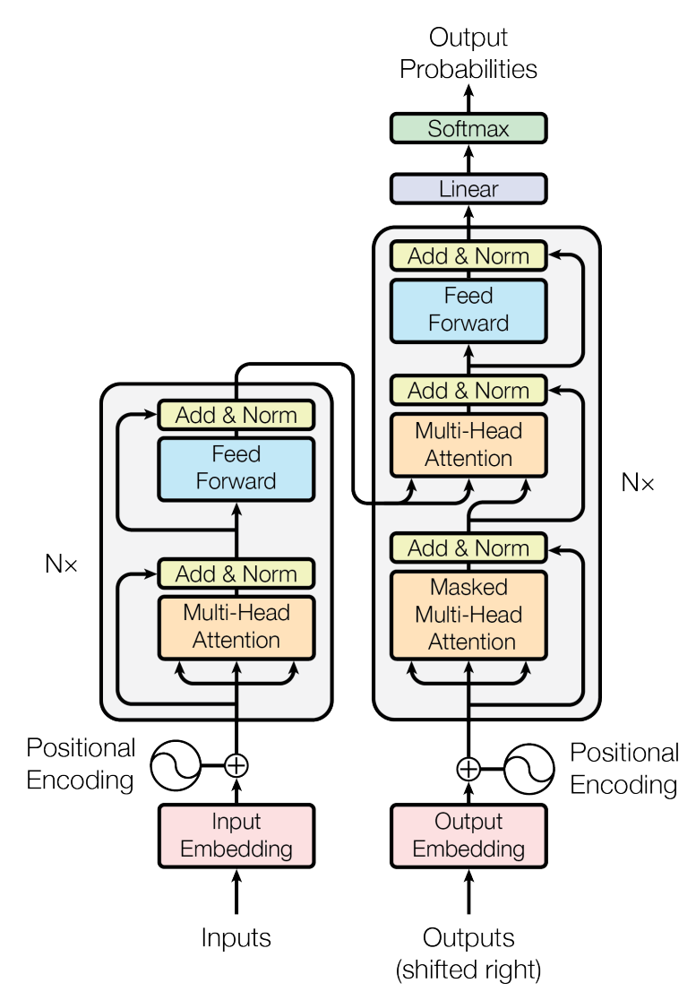
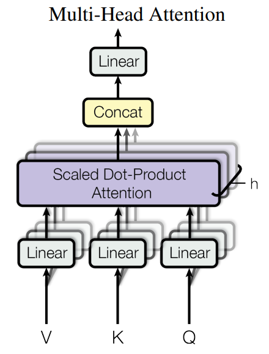
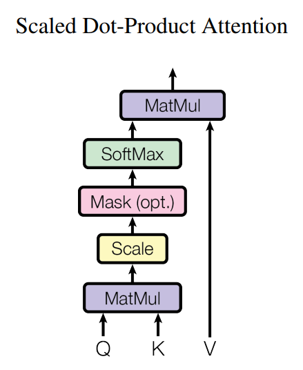

# Transformer from Scratch
by Christopher Ley 

## How to use
Simply run: 
    
    python train.py

to train the model. If you want to run the model with a different configuration simply specify:

    python train.py --config ./path/to/config.yaml

## Background
This is a reproduction of the paper [_Attention is all you need_](https://arxiv.org/abs/1706.03762) with some minor 
tweaks (like learnable positional encoding). This is mainly a development to improve my understanding of the 
architecture and how it relates to [_Graph Attention Networks_](https://arxiv.org/abs/1710.10903) (GAT) as highlighted in 
[_Everything is Connected: Graph Neural Networks_](https://arxiv.org/abs/2301.08210). The main point is the Transformer 
operates over a fully connected graph that learns the importance of its connections via dot product attention. Using an
attention mask is essentially providing an adjacency matrix to this graph. Dot product attention is highly 
parallelisable so exploiting this knowledge is useful for creating scalable GAT networks.

## Transformer Notes
### Model Architecture

### Multihead Attention

### Scaled Dot Product Attention

